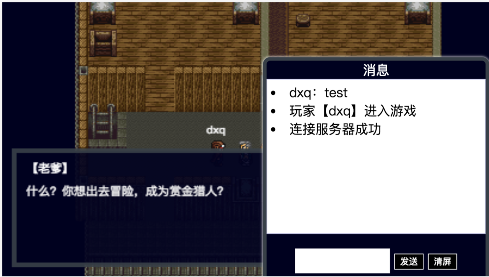
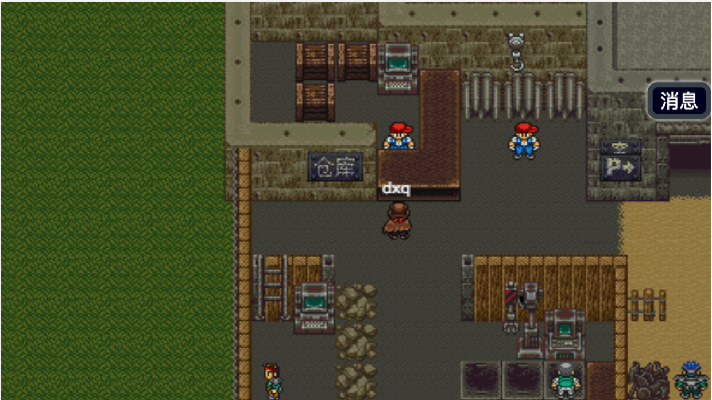
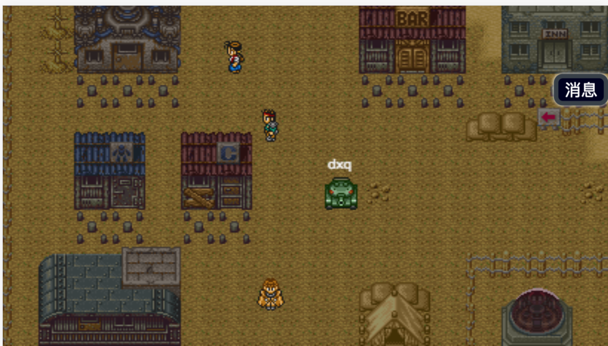
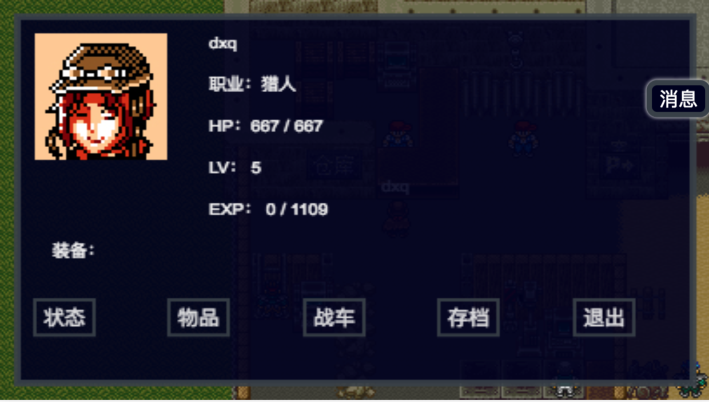
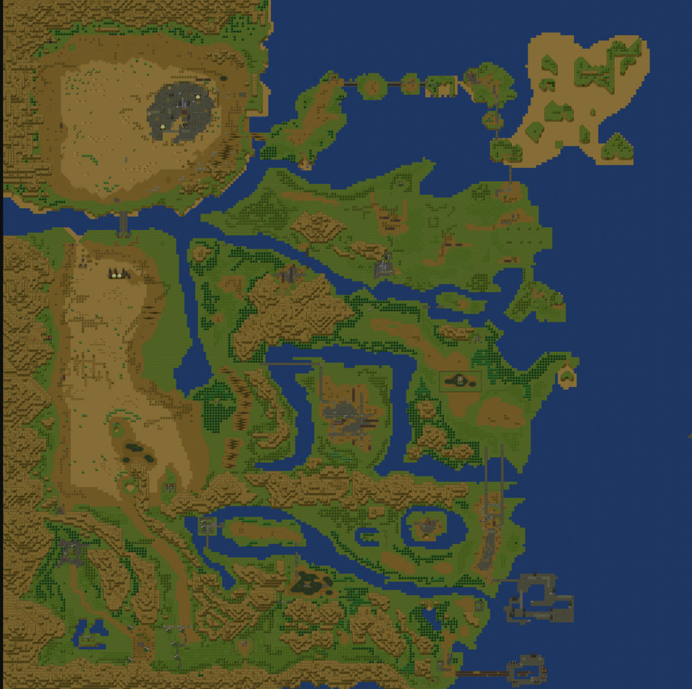

WastelandLegacy (废土战记)
======
## Game Screenhost






## 环境说明
```shell
# 本地 hosts，windows用户其他方法自行修改hosts
echo '127.0.0.1 mmr.game.com' >> /etc/hosts 

# 拉取镜像
docker pull registry.cn-beijing.aliyuncs.com/dxq_docker/nginx_php7:mmr

# run
docker run --restart unless-stopped --name mmr -itd -p 9001:9001 -p 80:80 registry.cn-beijing.aliyuncs.com/dxq_docker/nginx_php7:mmr

# 浏览器开启模拟手机模式，横屏，然后访问 mmr.game.com
# 源码在容器的 /var/www/ 目录下
```

## 游戏大概玩法
* 常规的重装机兵游戏内容：做任务，打怪，升级，赚钱，换装备，收集战车
* 新增弱联网系统
    * 玩家之间将能够看到对方的行动
    * 玩家之间可以相互发消息或世界消息
    * 当某玩家进入战斗时，你可以点击玩家，进行支援敌人或玩家的选项。（想想支援敌人，另一个玩家的表情...）
    * 不会同步钱，物品呀，存档呀什么的，这个弱联网基本只是增加玩家的交互

## 项目说明
* workerman代码在：https://github.com/war1644/wl-service
* 请无视master分支，最新代码都在dev分支
* 运行流程图：浏览器调用/index.html-->载入js ->main.js-->window.onload->main.js下main方法-->载入各种资源-->初始化-->连接workerman服务器
* 由于ajax不支持file://，所以请用本地域名访问index.html哦
* /Asset/下有大概的剧本、对话之类的
* 如果你要编辑地图，下载 https://www.mapeditor.org/ 打开/Asset/下的地图的tmx或者json后缀的文件

## 游戏说明
* 战斗系统
* 人车系统
* 装备系统
* 事件脚本
* 场景切换
* 做了一小章剧情
* 两幅世界地图绘制完毕
* 城镇村庄完成了 3 个，包括拉多镇
* 玩家通讯(websocket),后端用的 Workerman
* 玩家之间战斗支援
* 玩家在大地图的数据同步
* 其他

